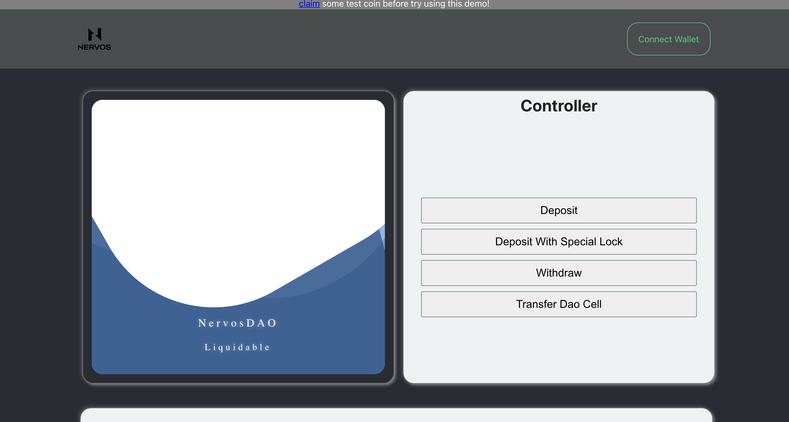

# CKB Liquidable DAO Dapp

This repo contains the dapp-side code using in the talk video - [Dapps On CKB: Building A Liquidable DAO workshop]().

In order to run this dapp, firstly you should deploy the smart contract on a CKB blockchain.

- dapp
- [smart contract](https://github.com/RetricSu/liquidable-nervos-dao-contract)

## development

this repo contains two parts: [server](packages/client) and [client](packages/server). you can check out each part in `./packages`.
